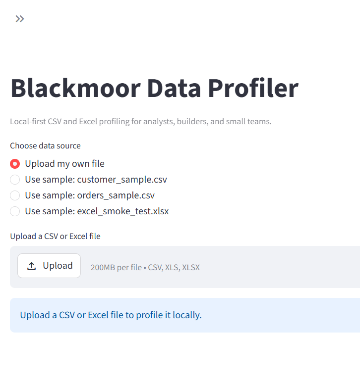
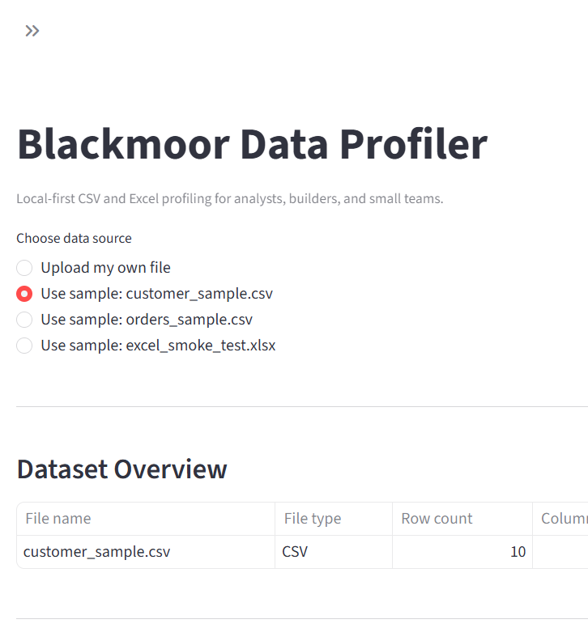

# Blackmoor Data Profiler

A local-first CSV and Excel profiling tool for analysts, builders, and small teams, with data quality checks and Markdown report export.

## Free Edition

Blackmoor Data Profiler Free is a local-first CSV and Excel profiling tool for analysts, builders, and small teams.

It helps users inspect files, understand column structure, identify common data quality issues, generate a basic data dictionary, and export a Markdown profile report.

The Free Edition is intended for lightweight local file review, demo workflows, and early dataset documentation.

For the Free Edition scope and future Pro feature candidates, see [PRODUCT_BOUNDARY.md](PRODUCT_BOUNDARY.md).

## Feedback

Feedback welcome: open a GitHub Issue.

## Current Features

- CSV upload
- Excel upload with sheet selection
- Dataset overview
- Column profile
- Data quality checks
- Markdown report export
- Local validation script

## Data Quality Checks Supported

- duplicate rows
- blank-heavy columns
- constant columns
- possible ID columns
- high-cardinality text columns
- possible date columns
- suspicious mixed-type columns

## Setup

Recommended:

- `scripts\setup.bat`

Manual setup:

1. `python -m venv .venv`
2. `.venv\Scripts\activate.bat`
3. `python -m pip install -r requirements.txt`

## Run The App

- `scripts\run_app.bat`

## Validate

- `scripts\validate.bat`

## Releases

- Current Free Edition tag: `v1.1.0-free-edition`
- Previous baseline tag: `v1.0.0-baseline`
- See [CHANGELOG.md](CHANGELOG.md) for changes
- See [docs/release_notes/v1.1.0-free-edition.md](docs/release_notes/v1.1.0-free-edition.md) for Free Edition release notes
- See [docs/release_notes/v1.0.0-baseline.md](docs/release_notes/v1.0.0-baseline.md) for baseline release notes

## Troubleshooting

- If dependencies are missing, activate `.venv` and run `python -m pip install -r requirements.txt`
- Prefer `scripts\validate.bat` and `scripts\run_app.bat` because they use the repo-local `.venv`
- If Streamlit does not start, confirm `.venv` was created and dependencies were installed

## Example Reports

Generated Markdown report examples are available under `reports/examples/`.

- [reports/examples/customer_sample_profile_report.md](reports/examples/customer_sample_profile_report.md)
- [reports/examples/orders_sample_profile_report.md](reports/examples/orders_sample_profile_report.md)
- [reports/examples/excel_smoke_test_profile_report.md](reports/examples/excel_smoke_test_profile_report.md)

## Screenshots

### App Home

### Customer Sample Profile

## Sample Data

Sample files are available under `sample_data/` and use fictional data only.
The app also includes a sample dataset selector for quick demo and testing workflows.

## Local-First Note

Files are processed in the locally running Streamlit app session and are not intentionally uploaded to any external service by this project.

## Data Privacy and Usage Notes

- This app is designed as a local-first tool.
- Uploaded files are processed by the locally running Streamlit app session.
- The project does not intentionally send uploaded files to external services.
- Users should still follow their organization’s data handling policies.
- Users should avoid testing with sensitive, regulated, confidential, proprietary, or employer-owned data unless they are authorized to do so.
- Sample files in this repo are fictional and intended for demo/testing only.

## Independent Project Note

- This is an independent personal project.
- It should use fictional, public, or properly authorized data only.
- It is not built from employer data, employer systems, internal dashboards, internal documents, or proprietary workplace materials.
- It does not imply endorsement by any employer or organization.

## Limitations

- Quality checks are heuristic and intended as first-pass indicators.
- Date detection and mixed-type detection may require human review.
- No PDF or HTML export yet.
- No saved report history yet.
- No AI/API integration yet.

## Project Status

This project is in early local tool development.
